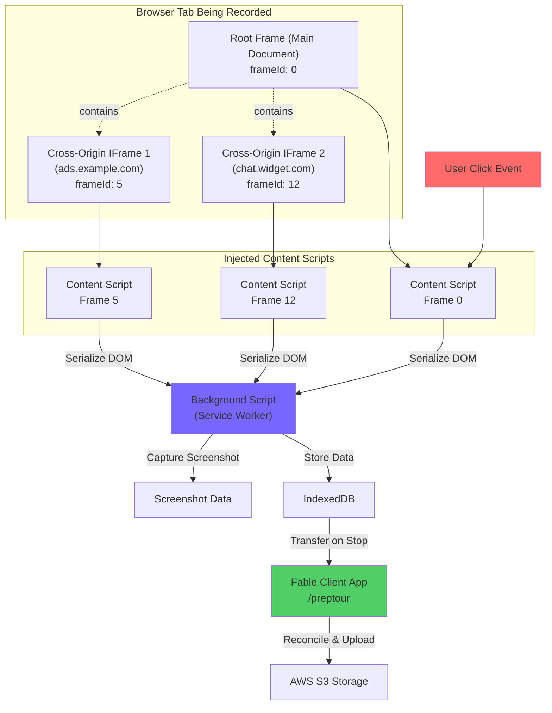
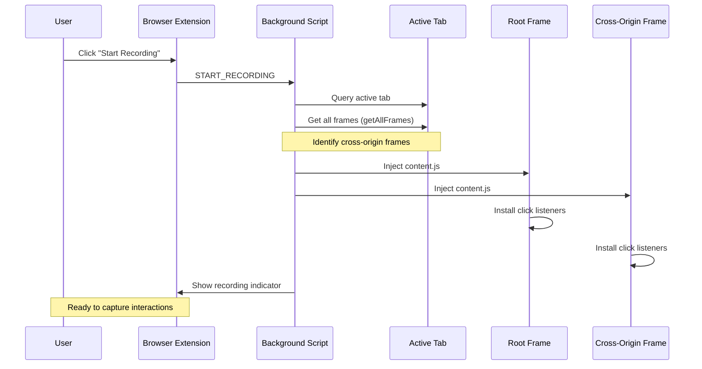
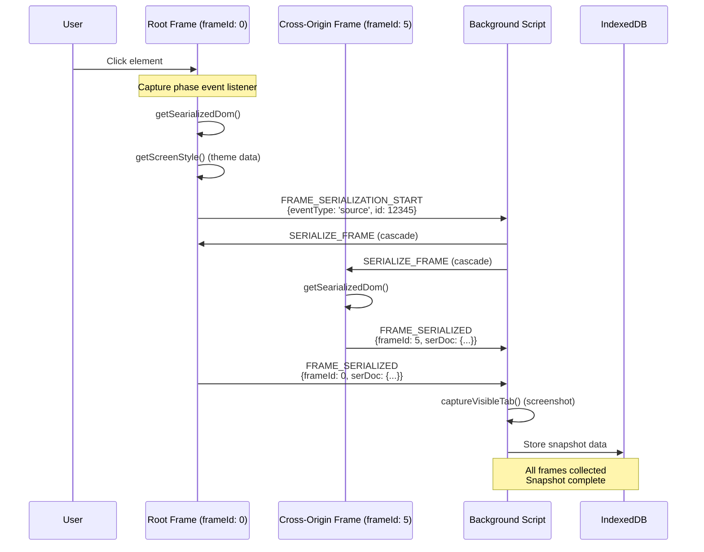
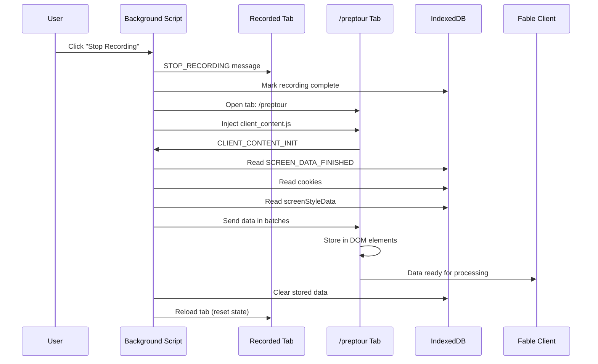
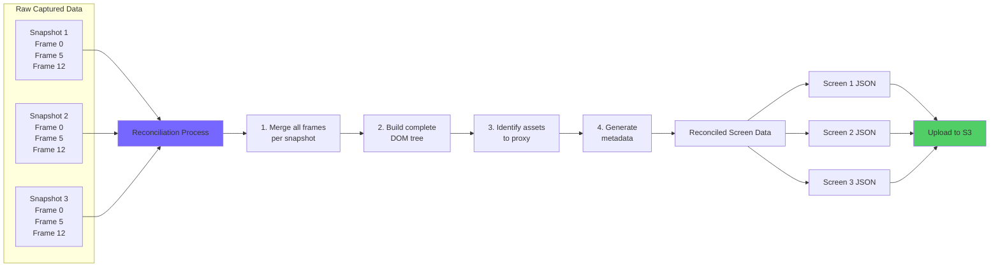
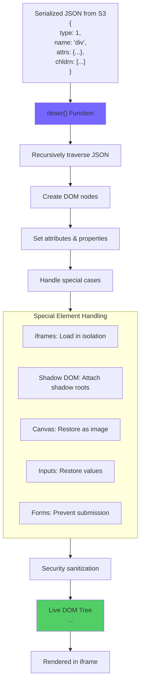
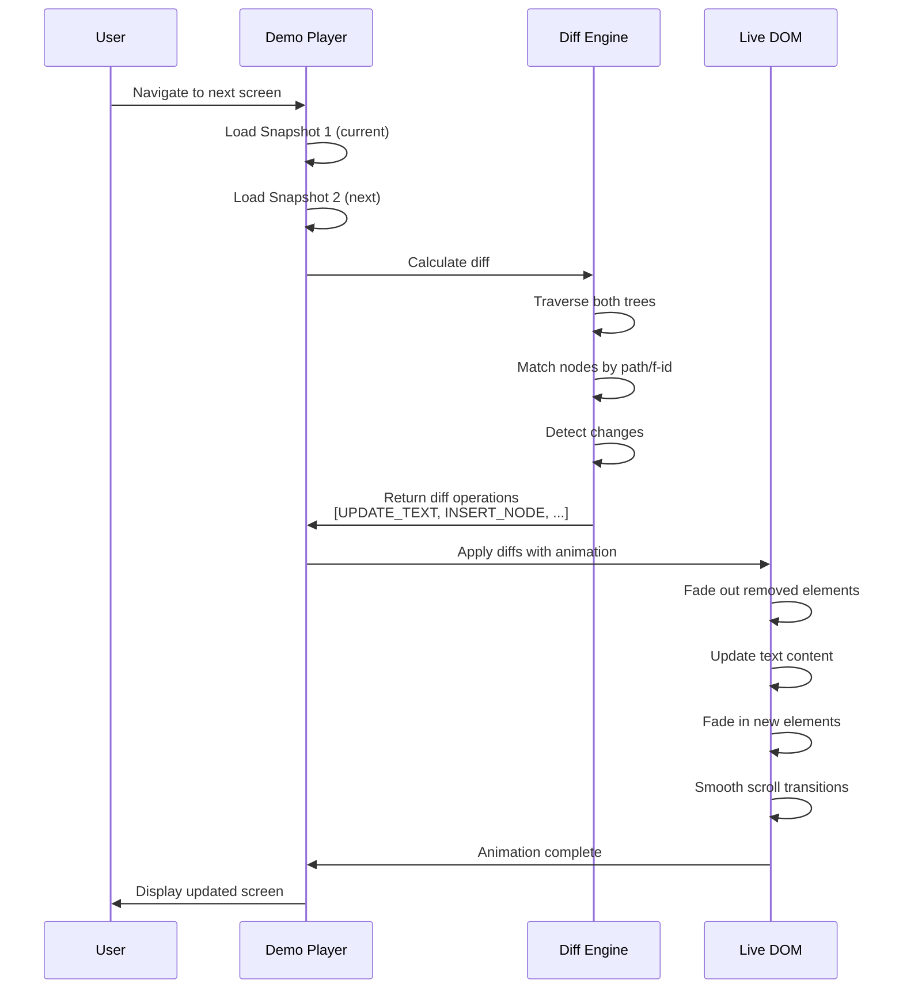
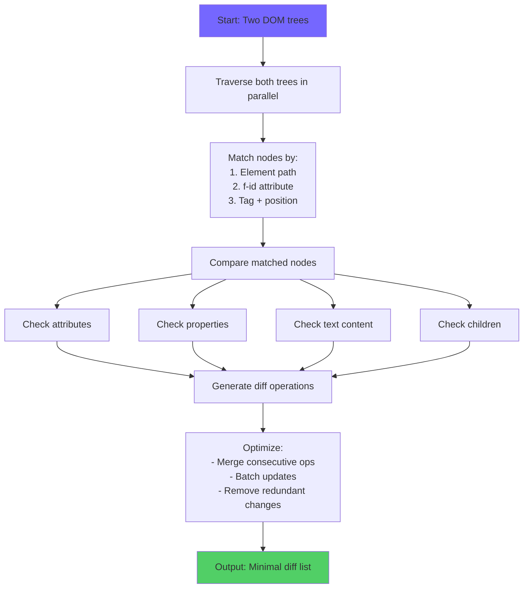
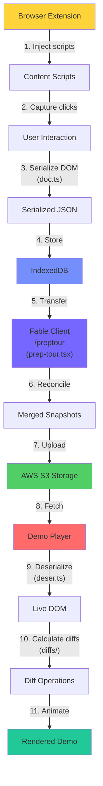

# Fable

> Open-source platform for creating interactive product demos and walkthroughs

[](https://opensource.org/licenses/Apache-2.0)
[](https://github.com/sharefable/app)

---

## Tech Stack

**Frontend Framework:**
- React 18.2 with TypeScript 4.8
- Redux + Redux Thunk for state management
- React Router v6 for routing
- Styled Components 5.3 for CSS-in-JS styling

**UI & Components:**
- Ant Design 5.8 - Component library
- Lexical 0.12.2 - Rich text editor
- CodeMirror v6 - Code editor
- Framer Motion 10.3 - Animations
- Recharts 2.12 - Charts and visualizations

**Build Tools:**
- Create React App 5.0.1 (not ejected)
- Webpack 5 (for browser extension)
- TypeScript for type safety
- Yarn Workspaces for monorepo management

**Key Integrations:**
- Auth0 - Authentication
- Sentry - Error tracking & monitoring
- Amplitude & PostHog - Analytics
- Chargebee - Billing & subscriptions
- Anthropic SDK - AI-powered features

---

## Project Structure

This project is organized as a Yarn Workspace monorepo:

```
workspace/packages/
├── client/         Main React web application
│   ├── src/
│   │   ├── container/      Redux-connected container components
│   │   ├── component/      Presentational UI components
│   │   ├── action/         Redux actions and action creators
│   │   ├── reducer/        Redux reducers
│   │   ├── hooks/          Custom React hooks
│   │   ├── analytics/      Analytics utilities
│   │   ├── user-guides/    User onboarding flows
│   │   └── types.ts        Global TypeScript type definitions
│   └── package.json
│
├── common/         Shared libraries and type definitions
│   ├── src/               TypeScript source files
│   └── dist/              Compiled JavaScript outputs
│
├── ext-tour/       Browser extension for recording demos
│   └── Chrome extension with Webpack build
```

---

## Prerequisites

- **Node.js** - v16.x or higher recommended
- **Yarn** - Latest version with workspace support

---

## Installation & Setup

### 1. Clone the Repository

```bash
git clone git@github.com:sharefable/app.git
cd app
```

### 2. Install Dependencies

```bash
yarn install
```

This will install dependencies for all packages in the monorepo.

### 3. Configure Environment

The `workspace/packages/env.json` file contains **public** client-side configuration values that are bundled into the frontend application. These values (`REACT_APP_*`) are visible in the browser and are not secrets.

**Important:** These are client-side environment variables that get compiled into your JavaScript bundle and are accessible via browser DevTools. They are meant to be public and safe to commit to version control.

The repository includes a working `env.json` with default development values. For production or custom deployments, modify:

```json
{
  "local": {
    "REACT_APP_API_ENDPOINT": "http://localhost:8080",
    "REACT_APP_JOB_ENDPOINT": "http://localhost:8081",
    "REACT_APP_CLIENT_ENDPOINT": "http://localhost:3000",
    "REACT_APP_DATA_CDN": "your-s3-bucket.s3.region.amazonaws.com",
    "REACT_APP_ENVIRONMENT": "local",
    "REACT_APP_AUTH0_DOMAIN": "your-auth0-domain.auth0.com",
    "REACT_APP_AUTH0_CLIENT_ID": "your-auth0-client-id",
    "REACT_APP_AUTH0_AUD": "backend",
    "REACT_APP_AMPLITUDE_KEY": "your-amplitude-key",
    "REACT_APP_POSTHOG_KEY": "your-posthog-key",
    "DISABLE_ESLINT_PLUGIN": true
  }
}
```

**For local development overrides:** Optionally create `env.local.json` (gitignored) to avoid modifying the shared `env.json`.

**Note:** For database and backend setup, please check the [Fable API](https://github.com/sharefable) and Jobs repositories.

### 4. Set Up Auth0

1. Create an Auth0 account at [auth0.com](https://auth0.com)
2. Create a new application (Single Page Application)
3. Configure your callback URLs:
   - Allowed Callback URLs: `http://localhost:3000/callback`
   - Allowed Logout URLs: `http://localhost:3000`
   - Allowed Web Origins: `http://localhost:3000`
4. Copy your Domain and Client ID to `env.json`

### 5. Start Development Server

```bash
cd workspace/packages/client
yarn start-local
```

The application will open at `http://localhost:3000`

---

## Development

**Script Naming Convention:**
- Scripts follow the pattern `yarn-{{prefix}}`
- `local` - Local development with local backend
- `dev` - Development environment with staging backend
- `staging` - Staging environment build
- `prod` - Production environment build

### Development Guidelines

Please follow these guidelines when contributing code:

1. **Fully Typed Systems**
   - Type everything with TypeScript as much as possible
   - Minimize usage of `any` type
   - Define proper interfaces and types

2. **Performance First**
   - Target 60fps across different systems (Windows/Linux/Mac)
   - Avoid unnecessary re-renders in React components
   - Be mindful of render function side effects

3. **Minimal Dependencies**
   - Don't add packages for trivial functionality
   - Consider copy-pasting small utilities instead of adding dependencies
   - Keep bundle size optimized

4. **Code Quality**
   - Use ESLint with Airbnb config
   - Follow the container/component pattern
   - Write clean, maintainable code

### Customizing Ant Design Theme

To override Ant Design CSS properties without ejecting Create React App:

```bash
yarn brand-asset-gen
```

This generates CSS overrides from Less files. [Read more about this approach](https://medium.com/@aksteps/customising-ant-design-antd-theme-without-using-react-eject-or-any-unreliable-libraries-782c53cbc03b).

---

## Architecture Overview

### State Management

**Redux Architecture:**
- Single Redux store with combined reducers
- Redux Thunk middleware for async operations
- Redux DevTools enabled in development
- Container components connect to Redux store
- Action creators handle API calls and side effects

### Routing Structure

Key application routes:

```
/                          → Dashboard (redirects to /demos)
/demos                     → Demo list and management
/tour/:tourId              → Demo editor
/embed/demo/:tourId        → Embedded demo player
/hub/:demoHubRid           → Demo hub editor
/analytics/demo/:tourId    → Analytics dashboard
/settings                  → User settings
/integrations              → Third-party integrations
```

Most routes use React lazy loading for code splitting and optimized bundle sizes.

---

## Internal Details: How Interactive Demos Work

Fable captures real web applications and turns them into interactive, editable demos. This section explains the technical architecture behind the demo capture, storage, and playback system.

### High-Level Overview

Each browser tab consists of:
- **1 root frame** (the main document)
- **0 to many cross-origin iframes** (embedded content from different domains)

Every user interaction (mouse click) triggers a DOM snapshot. The complete state of the tab—including all cross-origin frames—is serialized into a JSON representation.

**Recording Flow:**

```
User Actions:    [Start Recording] → [Click Header] → [Click Menu] → [Click Modal] → [Stop Recording]
                                            ↓                ↓               ↓
DOM Snapshots:                          Snapshot 1  → Snapshot 2   →  Snapshot 3   → Snapshot 4
```

**Note:** The first snapshot is captured on the first user interaction, not when recording starts. This prevents blocking the UI during initialization.

Each snapshot contains:
- Complete DOM structure (HTML tree)
- All CSS styles (inline, external, computed)
- Cross-origin iframe contents
- User input values (forms, checkboxes, etc.)
- Scroll positions
- Canvas/video states

---

### Capture Pipeline

The capture system works across multiple components to record user interactions:



---

### Step-by-Step Capture Process

#### 1. **Recording Initialization**

**File:** `workspace/packages/ext-tour/src/background.ts`

When the user clicks "Start Recording":



**Key Functions:**
- `startRecording()` - Initiates the recording session
- `injectContentScriptInCrossOriginFrames()` - Identifies and injects scripts into cross-origin frames
- `onTabStateUpdate()` - Tracks tab navigation and re-injects scripts

**Why cross-origin injection?**

Same-origin iframes can be accessed directly from the parent frame's JavaScript. However, cross-origin iframes are isolated by the browser's security model (CORS), so we must inject separate content scripts into each cross-origin frame to serialize its DOM.

#### 2. **User Interaction Capture**

**File:** `workspace/packages/ext-tour/src/doc.ts`

When the user clicks on any element (first click or subsequent clicks):



**Serialization Details:**

The `getSearializedDom()` function traverses the entire DOM tree and creates a JSON representation:

```javascript
{
  frameUrl: "https://example.com/page",
  title: "Page Title",
  frameId: "frame-123",
  docTreeStr: "{...}", // Stringified DOM tree
  rect: { width: 1200, height: 800 },
  postProcesses: [...], // Assets that need proxying
  iriReferencedSvgEls: {...}, // SVG sprite references
  icon: {...}, // Favicon data
  baseURI: "https://example.com/"
}
```

**What gets serialized:**

- **Element nodes:** Tag name, attributes, properties (checked, value, etc.)
- **Text nodes:** Text content
- **Style nodes:** CSS rules from `<style>` tags and external stylesheets
- **Shadow DOM:** Shadow roots and their contents
- **Canvas elements:** Converted to base64 PNG images
- **Input states:** Current values, checked states, selected options
- **Scroll positions:** `scrollTop` and `scrollLeft` as factors (0-1)
- **iframes:** Recursively serialized (same-origin) or marked for post-processing (cross-origin)
- **Assets:** Images, stylesheets, and other resources are identified for proxying

**What gets excluded:**

- `<script>` tags (security)
- `<noscript>` tags
- Elements with class `fable-dont-serialize`
- Hidden iframes (0px width/height)

#### 3. **Style Theme Extraction**

**File:** `workspace/packages/ext-tour/src/doc.ts` - `getScreenStyle()`

While serializing, Fable also extracts theme information for AI-powered suggestions:

```javascript
{
  nodeColor: {
    button: { "#7567ff": 15, "#ff6b6b": 8 },  // Color -> occurrence count
    a: { "#0066cc": 22 },
    div: { "#333333": 45 }
  },
  nodeBorderRadius: {
    button: { 4: 12, 8: 5 },  // Border radius -> occurrence count
    a: { 0: 18 },
    div: { 2: 30 }
  }
}
```

This data helps Fable suggest consistent themes when users customize their demos.

#### 4. **Data Storage in IndexedDB**

**Files:**
- `workspace/packages/ext-tour/src/background.ts` - Storage coordination
- `@fable/common/dist/db-utils.ts` - IndexedDB operations

The background script stores all captured data in IndexedDB:

```javascript
{
  id: "fable-tour-data",
  screensData: [
    {
      // Snapshot 1 (first user click)
      frames: [
        { frameId: 0, serDoc: {...}, thumbnail: "data:image/png;base64,..." },
        { frameId: 5, serDoc: {...} }  // Cross-origin iframe
      ],
      interactionCtx: { x: 450, y: 320, elementPath: "0.1.3.2" }
    },
    {
      // Snapshot 2 (second user click)
      frames: [...]
    }
  ],
  cookies: [...],  // All cookies for authentication replay
  screenStyleData: {...},  // Aggregated theme data
  version: "3"  // Data format version
}
```

**Why IndexedDB?**
- Can store large amounts of data (hundreds of MB)
- Avoids DOM injection issues that caused crashes on low-power devices
- Persistent across page reloads
- Asynchronous API for better performance

#### 5. **Data Transfer to Client**



---

### Reconciliation & Storage

#### 6. **Data Reconciliation**

**File:** `workspace/packages/client/src/container/create-tour/prep-tour.tsx`

The `/preptour` route performs critical reconciliation:



**Reconciliation Steps:**

1. **Read from IndexedDB:** Load all captured screen data
2. **Frame Merging:** For each snapshot, merge all frame data into a single coherent DOM tree
   - Root frame becomes the base
   - Cross-origin iframes are inserted at their correct positions
   - Each iframe maintains its own document structure
3. **Asset Identification:** Scan for resources that need to be proxied (images, stylesheets, fonts)
4. **Data Validation:** Ensure all snapshots are complete and valid
5. **Upload to S3:** Send processed data to backend for storage
6. **Redirect:** Navigate to `/create-interactive-demo` to start editing

**S3 Storage Format:**

```
s3://fable-tour-data/
  └── org_xyz/
      └── tour_abc123/
          ├── screen_001.json      # Snapshot 1 data
          ├── screen_002.json      # Snapshot 2 data
          ├── screen_003.json      # Snapshot 3 data
          ├── thumbnail_001.png    # Screenshot 1
          ├── thumbnail_002.png    # Screenshot 2
          ├── thumbnail_003.png    # Screenshot 3
          ├── assets/
          │   ├── proxied_image_1.png
          │   ├── proxied_style_1.css
          │   └── proxied_font_1.woff2
          └── metadata.json        # Tour-level metadata
```

Each `screen_XXX.json` file contains:

```javascript
{
  screenId: "scr_abc123",
  serDoc: {
    docTreeStr: "{...}",  // Complete merged DOM
    frameUrl: "https://app.example.com",
    title: "Dashboard - Example App",
    rect: { width: 1200, height: 800 },
    postProcesses: [
      { type: "asset", path: "0.1.5.2", url: "image.png" },
      { type: "iframe", path: "0.1.8", url: "https://..." }
    ]
  },
  thumbnail: "https://cdn.../screenshot.png",
  interactionCtx: { x: 450, y: 320, path: "0.1.3.2" },
  cookies: [...],
  metadata: {
    timestamp: 1704567890123,
    userAgent: "Mozilla/5.0...",
    viewport: { width: 1200, height: 800 }
  }
}
```

---

### Playback & Navigation

#### 7. **Deserialization**

**File:** `workspace/packages/client/src/component/screen-editor/utils/deser.ts`

When a demo is played back, the serialized JSON is converted back into a live DOM:



**Deserialization Process:**

1. **Create Elements:** For each node in the JSON tree, create the corresponding DOM element
2. **Set Attributes:** Apply all HTML attributes (class, id, src, href, etc.)
3. **Set Properties:** Restore element properties (checked, value, selected)
4. **Handle Special Elements:**
   - **iframes:** Create empty iframe with `about:blank`, then recursively deserialize its contents
   - **Canvas:** Restore canvas as an `` with the captured base64 data
   - **Shadow DOM:** Attach shadow roots and deserialize their contents
   - **Forms:** Prevent submission and restore input values
   - **Links:** Replace href with `javascript:;` to prevent navigation
   - **Images:** Use proxied CDN URLs, handle `srcset` attributes
5. **Security Sanitization:**
   - Remove `integrity` attributes (since we proxy CSS/JS)
   - Strip `sandbox` and `allow` attributes from iframes
   - Remove `<script>` tags from iframe `srcdoc`
   - Prevent form submissions and link clicks
6. **Restore State:**
   - Apply scroll positions using stored scroll factors
   - Check checkboxes and radio buttons
   - Select dropdown options
   - Fill input values (except passwords, which are masked)

**Iframe Handling:**

Iframes are deserialized in two phases:
1. Create the iframe element and attach to parent DOM
2. Wait for iframe to load (`onload` event)
3. Access `iframe.contentDocument` and recursively deserialize the child document

This ensures proper execution context and allows cross-origin iframes to be rendered correctly.

#### 8. **Diff Calculation & Animation**

**Files:** `workspace/packages/client/src/component/screen-editor/utils/diffs/`

When navigating between snapshots, Fable calculates and applies diffs to create smooth transitions:



**Diff Types:**

The diff engine identifies these change types:

- **INSERT_NODE:** New element added
- **REMOVE_NODE:** Element deleted
- **UPDATE_TEXT:** Text content changed
- **UPDATE_ATTRIBUTE:** Attribute value changed (class, id, src, etc.)
- **UPDATE_PROPERTY:** Element property changed (checked, value)
- **UPDATE_STYLE:** Inline style changed
- **REORDER_CHILDREN:** Child elements reordered

**Diff Algorithm:**



**Animation Application:**

The `apply-diffs-anims.ts` file applies diffs with smooth animations:

```javascript
// Example: Fading in a new element
{
  type: "INSERT_NODE",
  path: "0.1.3",
  node: newElement,
  animation: {
    duration: 300,
    easing: "ease-out",
    from: { opacity: 0, transform: "translateY(-10px)" },
    to: { opacity: 1, transform: "translateY(0)" }
  }
}
```

**Performance Optimizations:**

- **Virtual Scrolling:** Only diff visible elements
- **Debouncing:** Batch rapid navigation changes
- **RequestAnimationFrame:** Sync animations with browser repaint
- **Web Workers:** (Future) Diff calculation in background thread

---

### Data Flow Summary



---

### Key Technical Decisions

**Why serialize to JSON instead of HTML?**
- JSON is more compact and faster to parse
- Easier to apply transformations (proxying assets, removing scripts)
- Enables structural diffs for animations
- Can store metadata alongside DOM structure

**Why use IndexedDB instead of localStorage?**
- No size limits (localStorage capped at ~5-10MB)
- Asynchronous API prevents UI blocking
- Better performance for large datasets
- Structured storage with indexes

**Why proxy assets?**
- Original assets may be behind authentication
- External URLs may become unavailable
- Allows editing assets (cropping images, etc.)
- Ensures consistent demo experience over time

**Why inject into cross-origin frames?**
- Browser security (CORS) prevents accessing cross-origin iframe content
- Each frame requires its own execution context for serialization
- Maintains complete fidelity of the original page

**Why not snapshot on "Start Recording"?**
- Serialization is a blocking operation that can take 100-500ms for complex pages
- Starting recording should be instant to avoid UI lag
- First interaction is a natural point to capture the initial state
- Users expect the recording to "just work" without delays

---

## Configuration

### Environment Variables

The `env.json` file supports multiple environment profiles:

**Available Environments:**
- `local` - Local development
- `dev` - Development with staging backend
- `staging` - Staging environment
- `prod` - Production environment

**Key Environment Variables:**

| Variable | Description |
|----------|-------------|
| `REACT_APP_API_ENDPOINT` | Backend API server URL |
| `REACT_APP_JOB_ENDPOINT` | Jobs service URL |
| `REACT_APP_CLIENT_ENDPOINT` | Frontend application URL |
| `REACT_APP_DATA_CDN` | CDN for demo assets |
| `REACT_APP_AUTH0_DOMAIN` | Auth0 tenant domain |
| `REACT_APP_AUTH0_CLIENT_ID` | Auth0 application client ID |
| `REACT_APP_ENVIRONMENT` | Current environment name |
| `REACT_APP_CHARGEBEE_SITE` | Chargebee site identifier |
| `REACT_APP_AMPLITUDE_KEY` | Amplitude analytics key (deprecated) |
| `REACT_APP_POSTHOG_KEY` | PostHog analytics key |
| `GENERATE_SOURCEMAP` | Enable sourcemap generation (staging/prod) |

### Third-Party Integration Setup

**Auth0:**
- Configure application in Auth0 dashboard
- Set callback URLs and CORS settings
- Add domain and client ID to `env.json`

**Sentry:**
- Configure in CI/CD workflow
- Sourcemaps uploaded automatically during deployment
- DSN configured in application code

**Analytics (Amplitude/PostHog):**
- Add API keys to `env.json`
- Events tracked via `analytics/` utilities

---

## Deployment

### Build Process

The project uses Create React App for building:

```bash
# Staging build
cd workspace/packages/client
yarn build-staging

# Production build
yarn build-prod
```

Builds are output to `workspace/packages/client/build/`

### CI/CD Pipeline

Automated deployment via **GitHub Actions:**

**Workflow Steps:**
1. **Lint & Quality Checks** - ESLint and code duplication detection
2. **Build Common Package** - TypeScript compilation
3. **Build Extension** - Webpack bundle for browser extension
4. **Build Client** - Create React App production build
5. **Upload Sourcemaps** - Send sourcemaps to Sentry for error tracking
6. **Clean Sourcemaps** - Remove sourcemaps from production bundle
7. **Deploy to AWS** - Upload to S3 and invalidate CloudFront cache

**Deployment Targets:**
- **Staging:** Deploys on push to `develop` branch
- **Production:** Deploys on push to `master` branch with manual approval

**Infrastructure:**
- AWS S3 for static file hosting
- AWS CloudFront for CDN distribution
- Sourcemaps stored in Sentry only (not public)

---

## Browser Extension

### Building the Extension

```bash
cd workspace/packages/ext-tour
yarn build
```

The extension is built using Webpack and outputs to `dist/`

### Installing for Development

1. Build the extension (see above)
2. Open Chrome and navigate to `chrome://extensions`
3. Enable "Developer mode"
4. Click "Load unpacked"
5. Select the `workspace/packages/ext-tour/dist` directory

### Using the Extension

The browser extension allows you to:
- Record user interactions on any website
- Capture screenshots and video
- Create demo tours directly from browsing sessions
- Sync recordings with the Fable platform

**Extension ID** is configured per environment in `env.json` (`REACT_APP_EXTENSION_ID`)

---

## License

This project is licensed under the **Apache License 2.0**.

See [LICENSE](LICENSE) file for details.

Copyright © 2025 Fable. All rights reserved.

---

## Acknowledgments

For a complete list of dependencies and open-source libraries used in this project, please refer to:
- [`workspace/packages/client/package.json`](workspace/packages/client/package.json)
- [`workspace/packages/common/package.json`](workspace/packages/common/package.json)
- [`workspace/packages/ext-tour/package.json`](workspace/packages/ext-tour/package.json)

---

## Support

For questions, issues, or feature requests:

**[Open an issue on GitHub](https://github.com/sharefable/app/issues)**

---

## Additional Resources

- [Common Project Information](https://github.com/sharefable)
- [Yarn Workspaces Documentation](https://classic.yarnpkg.com/lang/en/docs/workspaces/)
- [Create React App Documentation](https://create-react-app.dev/)
- [Redux Documentation](https://redux.js.org/)
- [Ant Design Documentation](https://ant.design/)
